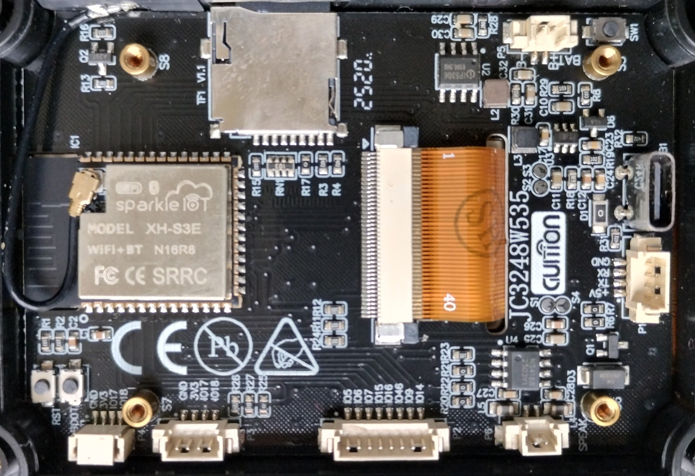

# JC3248W535


Basic “Hello World” project for the **Guition JC3248W535** display module using **ESP32-S3 + Arduino (PlatformIO)**.

---

## 📷 Hardware



---

## 🧩 Overview

The **JC3248W535** is a display module based on the ESP32-S3 with:

* Integrated LCD (AXS15231B controller)
* QSPI display interface
* Optional touch (I2C)

This repository provides a minimal working example to:

* Initialize the display
* Render graphics and text
* Use a framebuffer approach for stable output

---

## ⚙️ Development Environment

* IDE: Visual Studio Code
* Build system: PlatformIO
* Framework: Arduino (ESP32)

---

## 📦 Dependencies

* Arduino GFX Library
  https://github.com/moononournation/Arduino_GFX

---

## 🚀 Getting Started

### 1. Install PlatformIO

Install PlatformIO inside VS Code

### 2. Clone the repository

```bash
git clone https://github.com/carlosmsx/JC3248W535.git
```

### 3. Build & Upload

```bash
pio run -t upload
```

---

## 📁 Project Structure

```
JC3248W535/
├── src/
│   └── main.cpp
├── include/
├── lib/
├── docs/
│   └── board.jpg
├── platformio.ini
└── README.md
```

---

## ⚠️ Important Note (Rendering Issue & Solution)

### ❌ Problem

Direct rendering using `Arduino_GFX`:

```cpp
Arduino_GFX *gfx = new Arduino_AXS15231B(...);
```

Resulted in:

* corrupted graphics
* partial drawing
* unstable behavior

---

### ✅ Solution: Use a Framebuffer

```cpp
Arduino_Canvas *gfx = new Arduino_Canvas(320, 480, panel, 0, 0, 0);
```

And push updates manually:

```cpp
gfx->flush();
```

---

### 💡 Why it works

* Drawing happens in RAM (PSRAM)
* Full frame is transferred in one operation
* Avoids QSPI timing/synchronization issues

---

## 🧠 Memory Requirements

Framebuffer size:

```
320 × 480 × 2 bytes ≈ 300 KB
```

Requires:

* ESP32-S3 with PSRAM (e.g. N16R8)

### PlatformIO configuration:

```ini
build_flags =
    -DBOARD_HAS_PSRAM
```

---

## 🛠️ Display Initialization Example

```cpp
Arduino_DataBus *bus = new Arduino_ESP32QSPI(
    45, // CS
    47, // SCLK
    21, // D0
    48, // D1
    40, // D2
    39  // D3
);

Arduino_GFX *panel = new Arduino_AXS15231B(
    bus,
    GFX_NOT_DEFINED,
    0,
    false,
    320,
    480
);

Arduino_Canvas *gfx = new Arduino_Canvas(320, 480, panel, 0, 0, 0);
```

---

## 🧪 Demo Features

* Full screen color fills
* Text rendering
* Basic shapes
* Framebuffer-based rendering

---

## 📌 Notes

* Direct rendering is unreliable on this display
* Always prefer `Arduino_Canvas` + `flush()`
* Ideal for emulator-style rendering pipelines

---
